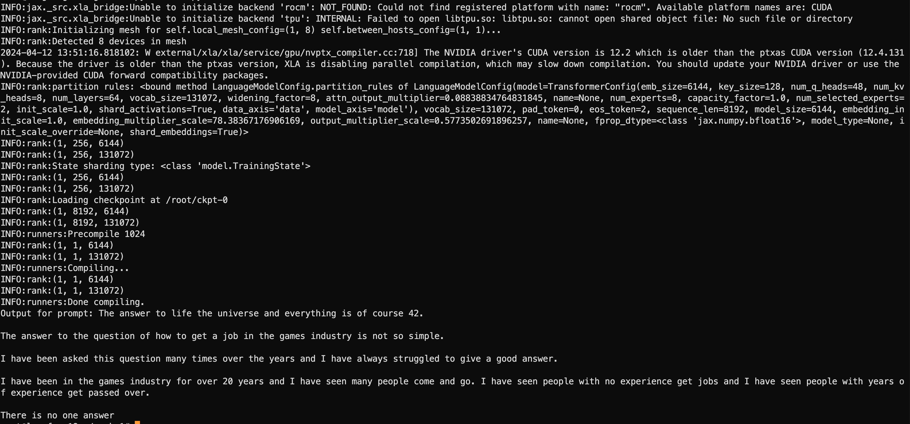

# grok-docker

Run [grok-1](https://github.com/xai-org/grok-1.git) with Docker.

# What did I do?

grok-1 relies on jax and jaxlib, both of which are very demanding on the system environment. This leads to a lot of
unexpected problems when running grok-1.

So after I successfully ran grok in a docker container, I made an image of it, and then you can pull it from dockerhub,
which I hope will help you.

# Quick Start

~~~
docker pull mayooot/grok-docker:v1
~~~

The latest [grok-1](https://github.com/xai-org/grok-1.git) source code is already included in the image, located
under `/root/grok-1`.
If you want to replace it, you can use `docker cp`.

Now let me show you how to run it.

You need to mount the model file under `/root/ckpt-0` of the container.
It like:

~~~
$ ls /root/ckpt-0/ | head -n 5
tensor00000_000
tensor00001_000
tensor00002_000
tensor00003_000
tensor00004_000
~~~

You can see a description of the details
at [Grok-1 本地部署过程](https://www.yuque.com/jasonxue/fi82qm/ziblwg0wo3eoid02?singleDoc#KBvnw).

Finally, run it.

~~~
docker run -d -it \
--network=host \
--shm-size 600g \
--name=grok-docker \
--gpus all \
-v $your-dir/ckpt-0:/root/ckpt-0 \
mayooot/grok-docker:v1
~~~

# Build From Source

~~~
git clone https://github.com/mayooot/grok-docker.git
cd grok-docker
docker build -t mayooot/grok-docker:v1 .
~~~

# Train

~~~ 
docker exec -it grok-docker bash

cd /root/grok-1/
python run.py
~~~

# Result

# Environment

## Server

* OS: Ubuntu 20.04.4
* Physical Storage: 1TB
* Physical Memory: 2TB
* GPU: 8 * NVIDIA A100 80GB
* Docker: 24.0.5
* Nvidia Driver: 525.85.12

## Container

~~~ shell
$ cat /etc/issue
Ubuntu 22.04.1 LTS \n \l

$ python --version
Python 3.10.8

$ nvcc --version
nvcc: NVIDIA (R) Cuda compiler driver
Copyright (c) 2005-2022 NVIDIA Corporation
Built on Wed_Sep_21_10:33:58_PDT_2022
Cuda compilation tools, release 11.8, V11.8.89
Build cuda_11.8.r11.8/compiler.31833905_0

$ pip show jax
Name: jax
Version: 0.4.26
Summary: Differentiate, compile, and transform Numpy code.
Home-page: https://github.com/google/jax
Author: JAX team
Author-email: jax-dev@google.com
License: Apache-2.0
Location: /root/miniconda3/lib/python3.10/site-packages
Requires: ml-dtypes, numpy, opt-einsum, scipy
Required-by: chex, flax, optax, orbax-checkpoint

$ pip show jaxlib
Name: jaxlib
Version: 0.4.26+cuda12.cudnn89
Summary: XLA library for JAX
Home-page: https://github.com/google/jax
Author: JAX team
Author-email: jax-dev@google.com
License: Apache-2.0
Location: /root/miniconda3/lib/python3.10/site-packages
Requires: ml-dtypes, numpy, scipy
Required-by: chex, optax, orbax-checkpoint
~~~